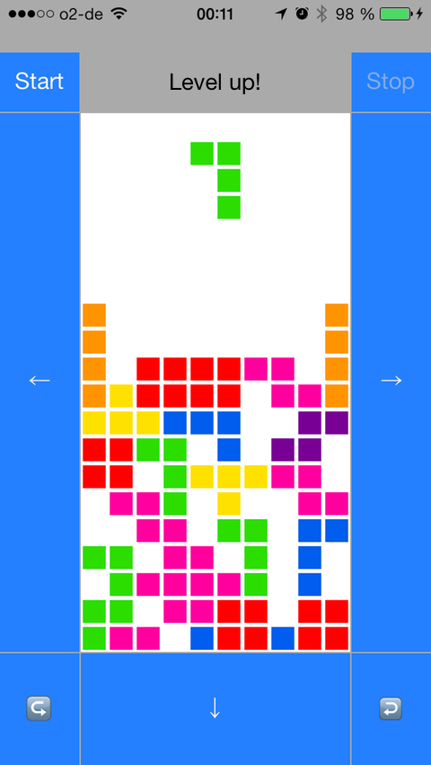

Mintris
=======

A minimal Tetr*s clone created in a couple hours and a few hundred lines of code.

## Controls

* Press “Start” button to start the game, “Stop” button to stop it. D’oh.
* Use the buttons to control tile movement left/right/down and tile rotation
* Tap the game view to rotate the tile
* Drag down on the game view to set tile straight down, same as the down button

## TODO

* Game over detection and handling
* Better tile rotation so that it always works, even when tile is at screen edge
* It does not feel quite right (hard to describe)
* Improved graphics & UI
* A scoring system
* Animations
  * When moving/rotating a tile (Maybe not, though.)
  * When line is cleared (Explosions! No, really, a particle effect would be awesome. Something like in Letterpress.)
* and much more…

## License

MIT for the code. I don’t have the license for the game idea. Please don’t sue me…
